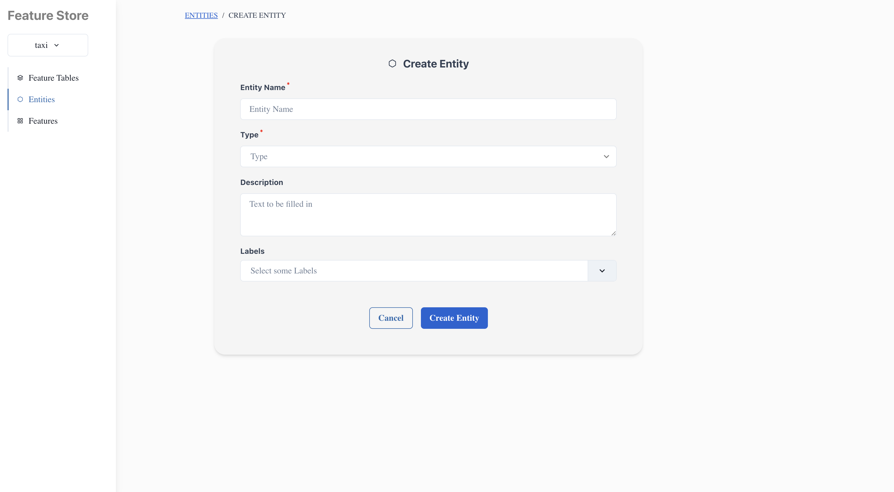
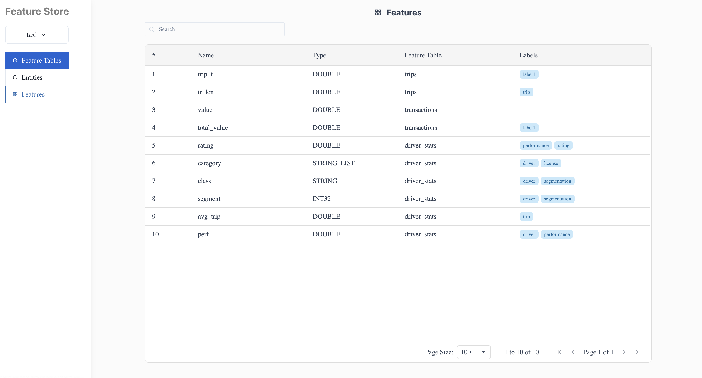

# Feature Store UI

## _Web UI for Feature Stores_

Feature Store UI is a responsive web UI for Feature Stores. To use it make sure that Feature store you are using is
compatible with contracts defined in this project.
The Feature Store UI designed to view, modify and create identities used in feature store-like systems.

## Features

- Create and switch projects
- Create, view and modify entities, features and feature tables
- Search entities, features and feature tables by labels, name or any other criteria





## Tech

Feature Store UI uses a number of open source projects to work properly:

- [React](http://react.dev)
- [Vite](https://vitejs.dev/)
- [Chakra UI](https://chakra-ui.com/)
- [React-hook-form](https://react-hook-form.com/)
- [React-icons](https://react-icons-v2.vercel.app/)
- [AG Grid](https://ag-grid.com/)
- [Tanstack query](https://tanstack.com/query/latest)
- [Axios](https://axios-http.com/ru/docs/intro)
- [React router](https://reactrouter.com/en/main)
- [Framer motion](https://www.framer.com/motion/)

## Installation

Install the dependencies and devDependencies and start the server.

```sh
npm i
VITE_SERVER_URL=your_backend_url or use mock
npm run dev
```

For production environments...

```sh
npm i
VITE_SERVER_URL=your_backend_url
npm run preview
```

## Docker

Feature Store UI is very easy to install and deploy in a Docker container.

By default, the Docker will expose port 8080, so change this within the
Dockerfile if necessary. When ready, simply use the Dockerfile to
build the image. Docker image requires VITE_SERVER_URL argument to run correctly:

```sh
docker build --build-arg VITE_SERVER_URL=<your_backend_url> -t <youruser>/feature-store-ui:${package.json.version} .
```

This will create the feature-store-ui image and pull in the necessary dependencies.
Be sure to swap out `${package.json.version}` with the actual version of Feature Store UI.

Once done, run the Docker image and map the port to whatever you wish on
your host. In this example, we simply map port 8000 of the host to
port 8080 of the Docker (or whatever port was exposed in the Dockerfile):

```sh
docker run -d -p 8080:8080 --restart=always --name=feature-store-ui <youruser>/feature-store-ui:${package.json.version}
```

Verify the deployment by navigating to your server address in your preferred browser.

```sh
127.0.0.1:8080
```

